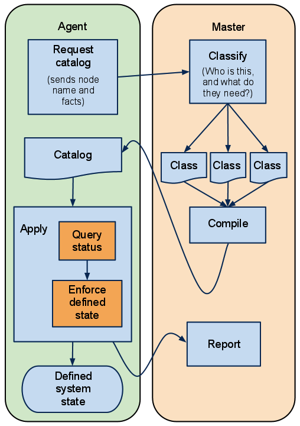

## 第2章 本書の方針

本書は、Puppet入門書としてはやや変わった構成を採っています。本章では、なぜそのような方針で構成したのかについて説明します。

### 本書の方針

「はじめに」で述べた通り、本書の目標は、この本を読んだ読者がPuppetの基本についてひととおり知り、オペレーションエンジニアの書いたmanifestに変更を加えたり、ある程度の規模のものなら自力でいちから書けるようになったりすることです。

そのため、膨大なPuppetの機能のうち、本質的な知識にのみ焦点をあてて説明します。といっても、実践を軽んじているということではまったくなく、むしろその逆で、読了と同時、あるいは、本書を読みながら、読者が実際にPuppetを始められることを目指しています。

本書の方針は、上述の「すぐに実践できる知識についてのみ説明する」の他、以下の通り挙げられます。

  1. ハンズオンを行っているかのように説明する
  2. agent/master構成を採らない
  3. node情報を管理しない
  4. 必ずしも標準的なディレクトリ構成を用いない

それぞれについて説明します。

### ハンズオンを行っているかのように説明する

本書は実践的なPuppet入門を目指していますので、この本を読むみなさんには、是非とも実際に手を動かし、manifestを書きながら読み進めていっていただきたいと思います。Puppetに限らず、それが新しい技術的知識を習得する上で、一番の近道だからです。

本書は「〜というファイルを以下の内容で作成してください」「〜というコマンドを実行してください」と、順番に説明いく構成を採っていますので、その説明に従い、実際に手を動かしていくとよいでしょう。また、他のエンジニアに対してPuppetについての研修を行うといった場合の、ハンズオン資料としても使えるでしょう。

時間的な関係で実際に手を動かすのが難しい場合でも、本書で作成していくmanifestを、以下のサポートページに完全な形で掲載していますので、すくなくともそれらを実際に適用しながら読み進めていくことをおすすめします。

  * 本書のサポートページ: [https://github.com/kentaro/puppet-book-support](https://github.com/kentaro/puppet-book-support)

### manifestをどこに置き、どこで適用するか

本書は、基本的には次章で紹介するVagrantという仮想化ツール(のサポートツール)を利用し、manifestを作成・適用していくことを前提としています。しかし、Vagrantを使わずに、既存のLinuxその他の環境(自宅サーバやVPS、クラウド環境など)で直接試したいという読者もいるでしょう。ここでは、Vagrantを使う場合と、そうでない場合とに分けて、説明します。

#### Vagrantを使う場合

Vagrantを使う場合は、manifestその他のファイルの作成・編集はホストOS上で行います(本書の作業環境の場合はMac上)。manifestの適用時のみ仮想ホストにSSHログインして、`puppet`コマンドを実行します。

上記サポートページで提供されているファイル群を利用する場合は、ホストOS上の適当なディレクトリで、以下のように`git clone`コマンドによってダウンロードしてください。

```
$ git://github.com/kentaro/puppet-book-support.git
```

次章で説明する通り、VagrantはホストOSと仮想ホストとの間でディレクトリを共有する機能がありますので、上記で`git clone`したホストOS上のファイルが、仮想ホスト上からも見える状態になります。そのため、ファイルを仮想ホストへデプロイする手間なしに、ファイルの作成・編集はホストOS上で、その適用は仮想ホスト上で、といったことが可能です。

#### Vagrantを使わない場合

Vagrantを使わずに、ご自身のLinuxその他の環境でPuppetを実行する場合は、以下のふたつがあり得ます。

  1. manifestその他のファイルの作成・編集も、それらのシステムへの適用も同じ環境で行う
  2. manifestその他のファイルの作成・編集はホストOS上で、それらの適用はホストOSとは別のLinuxその他のホストへ

1の場合は「Vagrantを使う場合」で説明したのと同様に、適当なディレクトリに`git clone`すれば準備完了です。2の場合は、ホストOS上で`git clone`してきたファイルを、`rsnyc`や`scp`コマンドなどを利用してデプロイした上で適用することになるでしょう。

いずれにせよ、Vagrantを使うほうが便利なので、筆者としてはVagrantを使うことを強くおすすめします。また、リモートホストへのmanifestのデプロイ・適用については、「第20章 リモートホストに対してmanifestを適用する」で解説します。

### agent/master構成を採らない

Puppetには「agent/masterモード」と呼ばれる構成があります。agentとは、構成管理の対象となるサーバ(nodeと呼ばれます)、正確には、そのnode上で動くクライアントプログラムです。一方masterとは、nodeとは独立に存在し、agentからのリクエストに応えてコンパイルされたmanifest(catalogと呼ばれます)を配布する役割を担います。

[Puppet Labsの公式ドキュメント](http://docs.puppetlabs.com/learning/agent_master_basic.html)に掲載されている以下の図を見ると、容易にイメージできるでしょう。



本書では、このagent/master構成を採用しません。理由は以下の通りです。

  1. agent/master構成は大規模なクラスタには有用だが、小規模なサービスの場合はなくても事足りる
  2. masterの設定や運用はそれなりに難しい
  3. 将来、本当に必要になった時にagent/master構成へスイッチすればいい

本書は、Puppetのmanifestをそれぞれのnode上で個別に適用する方式、具体的には`puppet apply`コマンドのみを使う方法を採ります(Chefをご存知の方は、Chef Soloを想起するとわかりやすいでしょう)。まず小さな規模から実践したいという本書の目的からいって、じゅうぶん理に叶った方針であると考えます。

### node情報を管理しない

Puppetのagent/master構成では、nodeをホスト名に基づいて識別し、それぞれについてどのような状態が適用されるべきかという記述を行います。具体的には、以下のような記述があったとして、

```
node 'app001.example.com' {
  # app001用の設定
}

node 'db001.example.com' {
  # db001用の設定
}
```

`app001.example.com`のagentと、`db001.example.com`のagentとで設定を分けることで、特定のnodeに対して特定のmanifestを適用できます。

これは便利な機能ではある一方、以下の理由により本書では採りません。

  1. agent/master構成を採用しないので使えない
  2. node情報は別の場所で管理したい

2については、具体的には「第20章 リモートホストに対してmanifestを適用する」で説明する通り、[capistrano](http://capistranorb.com/)で実現します。本書の説明に従ってmanifestを書いていけば、capistrano + `puppet apply`コマンドで、小規模環境なら十分に機能する道具立てがそろいます。

### 必ずしも標準的なディレクトリ構成を用いない

第1章でChefとの比較において述べた通り、Puppetはディレクトリ構成において、Chefより比較的自由です。そのため、manifestを気をつけて構成していかないと、保守性に乏しいものになってしまいがちです。

本書では、Puppetのベストプラクティスを適宜参照することでそうした混沌を避けつつ、保守性の高いかっちりした構成と、上記で述べてきたような実践の容易さとを両立する方法を紹介します。

### まとめ

本章では、本書の方針と、なぜそのような方針を採用するのかについて説明しました。

構成管理というと、大規模なクラスタのためのものというイメージが強く、Puppetももちろんそのような要件に対応するべく開発が進められてきたのですが、それだけではもったいないというのが筆者の考えです。

本書の方針は、Puppetによる構成管理の自動化と、その学習・運用コストをてんびんにかけ、両方のいいとこ取りが可能な、適切なバランスであると考えます。
