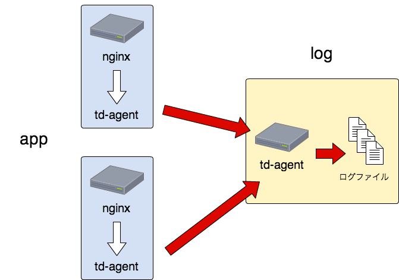

## 第12章 td-agentのmanifestを書く

前章まででひと通りのresource typeを見てきたところで、本章からはいくつかの章にまたがって、さらに実践的なmanifestを書いていきます。取り上げる題材は、td-agentです。

[td-agent](http://docs.treasure-data.com/articles/td-agent)は、[Treasure Data](http://www.treasure-data.com/)の提供するログ解析基盤へと、ログを収集・集約するためのツールです。そのコアをなす[fluentd](http://fluentd.org/)に、Treasure Dataのクライアントとしての機能などをパッケージングし、提供するものです。

### なぜtd-agentなのか

なぜtd-agentを題材に取り上げるのでしょうか。以下の理由によります。

  1. 構成が比較的シンプルであること
  2. 複数台のホストをまたがった構成が通常であること

我々はこれまで、Puppetの基本的な要素を見てきただけですので、あまりにも複雑なmanifestに取り組むのはまだ早いでしょう。そこで、比較的構成がシンプルなtd-agentを題材に選びました。とはいえ、今後、manifestをどんどん書いていけるようになるためには、実戦でそのまま使えるレベルのものを書いてみなければなりません。

td-agentは、ログ収集をするagentと、ログ集約をするagentを分けて管理するのが一般的な構成です。具体的には下図のような構成となります。

あるひとつのサービスを提供するに際して、ただひとつのサーバのみを構築するというよりも、複数のサーバを構築し、システムを構成することがほとんどでしょう。その意味でも、今回のtd-agentによる例は、実践的です。

### なにを学ぶのか

実践的なmanifestを書くには、これまでに学んできた簡単な文法、resource typeだけではすこし足りません。システム全体の状態を記述する大規模なmanifestを書くには、システムを要素に分解し、わかりやすく構造化して記述していく必要があります。そのために、Puppetには`class`と`module`という仕組みがあります。

システム構成が複雑になり、manifestが大規模化してくると、変更を正しく加えることが難しくなってきます。ある箇所を変更するとそれに依存する別の箇所にも影響が及び、そのことで正しくシステムが構成されないということが起こり得ます。そこで、システム記述にもプログラミングにおける「テスト」の概念を持ち込み、安全にmanifestを書いていく方法を学びます。

先述の通り、あるシステムは複数のホストからなります。また、それらのホストは、様々な役割(ロール)を持つものとしてグルーピングして管理されることが一般的です。Puppetにおいてそのような役割による管理を実現する方法や、また、複数のホストにmanifestを適用する方法についても、td-agentのmanifestを通して学んでいきましょう。

### まとめ

Puppetについての基本的な知識を学習し終えたところで、より実践的なmanifestを書くべく、本章では、今後数章をかけて学んでいくことになる内容について、ざっと紹介しました。
