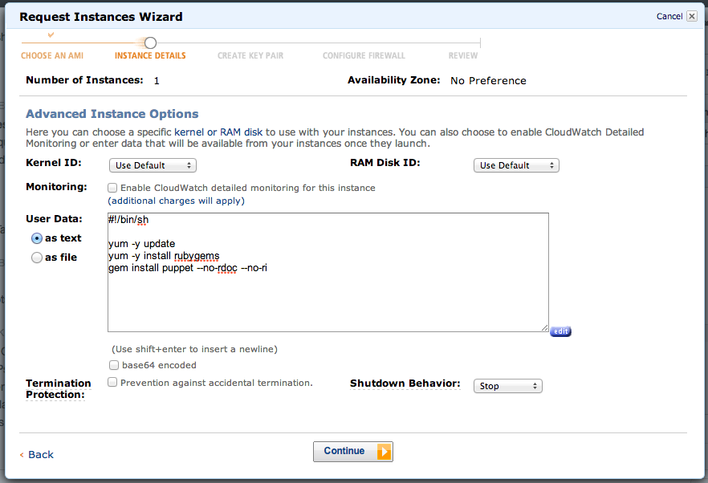
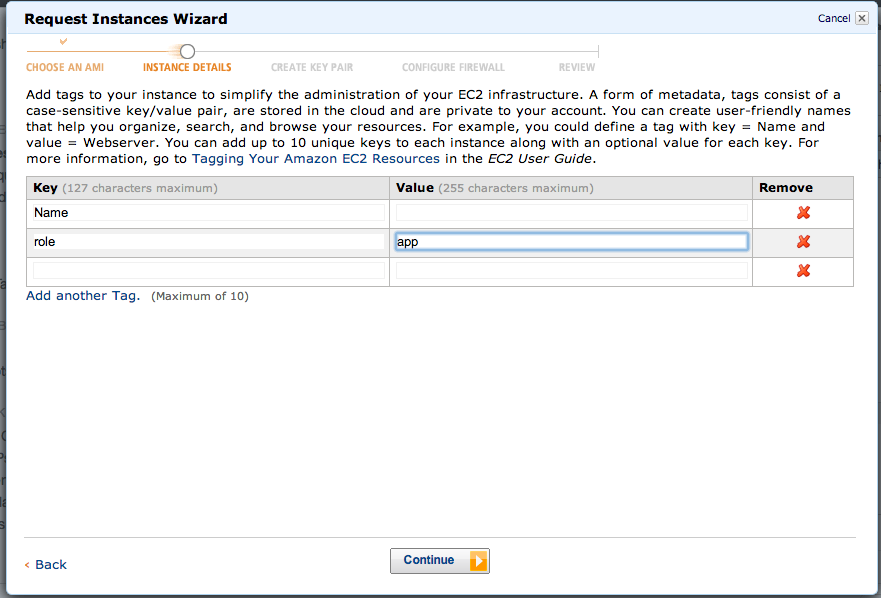

## 第20章 リモートホストに対してmanifestを適用する

前章までは、Vagrantによる仮想ホストに1台ずつSSHログインして`puppet apply`コマンドを実行することでmanifestを適用してきました。開発時はそれでも事足りるでしょうが、本番環境にはたくさんのサーバがあり得ます。いちいちログインしてまわるわけにもいきません。

本章ではより実践的に、複数台のAmazon EC2のホストに対していっせいにmanifestを適用することを通して、本番環境へ効果的にmanifestを適用する方法を見ていきましょう。

### capistrano

複数のリモートホストに対して、一箇所から一気にコマンドを実行する方法や、それに特化したツールにはたくさんのものがありますが、ここでは定番の[capistrano(http://capistranorb.com/)を使うことにしましょう。

capistranoはRuby製のデプロイツールで、Ruby on Railsアプリケーションのデプロイに便利な機能を持っています。とはいえ、Railsアプリケーション以外のデプロイにも使えますし、単純に、複数ホストへコマンドをいっせいに実行するという目的のためにも便利に使えます。

単に複数のホストに対してコマンドを実行するだけであれば、ホストOS側でシェルスクリプトを書くなどして対応することもできますが、ここでは以下の理由によりcapistranoを採用しています。

  * capistranoには採用実績が多数あり、ドキュメントも豊富であること
  * 今後の変更可能性にそなえて、より保守性の高いツールを利用する方がよいだろうこと
  * manifestを適用するホストを設定ファイル内に決め打ちせず、EC2のAPIから取得するため、Rubyのような言語で書く方が楽であること

### capistranoのセットアップ

まずは`gem`コマンドにより、capistranoをインストールします。

```
$ gem install capistrano
```

また、capistranoの設定ファイルの中で使う`aws-sdk`ライブラリも、ここでインストールしておきましょう。

```
$ gem install aws-sdk
```

次に、capistranoの設定ファイルを準備します。manifestのルートディレクトリで、`capify`コマンドを実行してください(`capify .`と、カレントディレクトリを指定するのを忘れないように)。

```
$ capify .
[add] writing './Capfile'
[add] making directory './config'
[add] writing './config/deploy.rb'
[done] capified!
```

上記の操作で作成された`config/deploy.rb`を、後述の通り編集します。

### Amazon EC2に本番ホストを用意する

次に、本番環境を想定し、Amazon EC2にホストを用意しましょう。今回は、`app`ロールのホストを2台用意します。

今回、capistranoによりmanifestを適用できるようにするための前提として、以下があります。

  1. Puppetがインストール済みであること
  2. `role`というキーで、`app`または`log`というタグが付与されていること
  3. `~/.ssh/puppet-book.pem`を使って、ec2-userでSSHログインできること

Amazon EC2の詳しい使い方については、よいドキュメントや書籍が多数ありますので、そちらを参照してください。ここでは、上記の条件を満たす方法についてのみ説明します。

1の「Puppetがインストール済みであること」について。まずは、なにはともあれPuppetがインストールされていないことにははじまりません。User Dataという仕組みを使うと、インスタンスの作成時に任意のスクリプトを実行できますので、それを用いてPuppetをインストールするのが簡単です。インスタンス作成ウィザードで、以下の画像の通り指定してください。



2の「`role`というキーで、`app`または`log`というタグが付与されていること」について。後述のcapistranoの設定で、タグによって適用すべきロールを判別する設定をしますので、あらかじめ適切なタグを付与しておきます。`app`ロールの場合、以下の画像のように設定してください。



最後に「`~/.ssh/puppet-book.pem`を使って、ec2-userでSSHログインできること」について。EC2のホストにSSHログインするのに必要な秘密鍵を、`~/.ssh/puppet-book.pem`としてコピーしておいてください。後述のcapistranoの設定で使います。また、作成したホストにSSHログインできるよう、セキュリティグループで22番ポートへのアクセスを許可するよう、あらかじめ設定しておいてください。

### capistranoの設定

準備が整ったところで、capistranoの設定ファイルを準備しましょう。`config/deploy.rb`を、以下の内容に修正します。

```
require 'aws-sdk'
require 'capistrano/ext/multistage'

set :application, "puppet-book"
set :repository,  "."
set :deploy_to,   "/tmp/#{application}"
set :deploy_via,  :copy
set :puppet_role, nil

set :access_key_id,     ENV['AWS_ACCESS_KEY_ID']
set :secret_access_key, ENV['AWS_SECRET_ACCESS_KEY']
set :region,            ENV['AWS_REGION']

set :use_sudo, false
default_run_options[:pty] = true
ssh_options[:keys] = [File.join(ENV["HOME"], ".ssh", "puppet-book.pem")]

namespace :puppet do
  namespace :apply do
    task :app do
      set :puppet_role, "app"
      deploy.update
      apply_manifest("app")
    end

    task :log do
      set :puppet_role, "log"
      deploy.update
      apply_manifest("log")
    end
  end
end

def apply_manifest(puppet_role)
  sudo "puppet apply --modulepath=#{current_path}/puppet/cluster/modules:#{current_path}/puppet/cluster/roles #{current_path}/puppet/cluster/manifests/#{puppet_role}.pp"
end

def ec2_instances(puppet_role)
  ec2 = AWS::EC2.new(
    access_key_id:     access_key_id,
    secret_access_key: secret_access_key,
    region:            region,
  )

  instances = ec2.instances.select do |instance|
    # tagは["key", "value"]という構造になっている
    name_tag = instance.tags.find { |tag| tag[0] == "role" }
    name_tag && instance.status == :running && (
      !puppet_role || name_tag[1] == puppet_role
    )
  end

  instances.map { |instance| instance.dns_name }
end
```

また、以下の内容で、`config/deploy/production.rb`というファイルを作成してください。

```
set :user, "ec2-user"

role :production do
  ec2_instances(puppet_role)
end
```

この設定では、以下のことを行います。

  * `cap production puppet:apply:app`とした場合は`app`ロールの、`cap production puppet:apply:log`とした場合は`log`ロールのホストに対して、それぞれに対応するmanifestを適用する
  * aws-sdkライブラリを使い、各ロールに対応するホスト情報を、AWSのAPI経由で自動的に取得する
  * `ec2-user`でログインし、`puppet apply`を実行してmanifestを適用する

### manifestを適用する

まず初めに、AWSのAPIキーを以下のURLからあらかじめ取得しておいてください。

[https://portal.aws.amazon.com/gp/aws/securityCredentials](https://portal.aws.amazon.com/gp/aws/securityCredentials)

上記の設定では、それらのキーを環境変数を通してcapistranoにわたすよう設定しているのですが、コマンドの実行時に、いちいち環境変数を指定するのは面倒ですので、以下のように、ファイルに記述しておくとよいでしょう(このファイルをリポジトリにコミットすることがないよう、`.gitignore`に追加しておきましょう)。

aws_environment.sh:

```
export AWS_ACCESS_KEY_ID='あなたのaccess_key_id' \
export AWS_SECRET_ACCESS_KEY='あなたのsecret_access_key' \
export AWS_REGION='ホストを作成したリージョン'
```

上記のファイルを`source`コマンドによってあらかじめ読み込んでおきます。

```
$ source aws_environment.sh
```

その上で、以下の通り`deploy:setup`コマンドにより、リモートホストのセットアップを行います。ちなみに、このコマンドはcapistranoがデフォルトで提供するものですので、上記の設定には記述されていません。

この操作は、インスタンス作成直後にいちど行うだけでけっこうです(複数回実行しても問題ありません)。

```
$ cap production deploy:setup
    triggering load callbacks
  * 2013-04-24 01:29:18 executing `production'
    triggering start callbacks for `deploy:setup'
  * 2013-04-24 01:29:18 executing `multistage:ensure'
  * 2013-04-24 01:29:18 executing `deploy:setup'
  * executing "mkdir -p /tmp/puppet-book /tmp/puppet-book/releases /tmp/puppet-book/shared /tmp/puppet-book/shared/system /tmp/puppet-book/shared/log /tmp/puppet-book/shared/pids"
    servers: ["ec2-175-41-216-81.ap-northeast-1.compute.amazonaws.com", "ec2-54-249-198-208.ap-northeast-1.compute.amazonaws.com"]
    [ec2-54-249-198-208.ap-northeast-1.compute.amazonaws.com] executing command
    [ec2-175-41-216-81.ap-northeast-1.compute.amazonaws.com] executing command
    command finished in 99ms
  * executing "chmod g+w /tmp/puppet-book /tmp/puppet-book/releases /tmp/puppet-book/shared /tmp/puppet-book/shared/system /tmp/puppet-book/shared/log /tmp/puppet-book/shared/pids"
    servers: ["ec2-175-41-216-81.ap-northeast-1.compute.amazonaws.com", "ec2-54-249-198-208.ap-northeast-1.compute.amazonaws.com"]
    [ec2-175-41-216-81.ap-northeast-1.compute.amazonaws.com] executing command
    [ec2-54-249-198-208.ap-northeast-1.compute.amazonaws.com] executing command
    command finished in 131ms
```

次に、以下の通り`puppet:apply:app`コマンドにより、リモートホスト(この場合は`app`ロールのホストのみ)に対してmanifestを適用します。

```
$ cap production puppet:apply:app
```

(コマンド出力は長くなるので省略します。実行して確かめてください)

以上で、複数台のリモートホストに対して、そのいちいちにSSHログインすることなしに、手元からmanifestを適用することができました。今回は`app`ロールのみに適用しましたが、同様の手順で、`log`ロールに対してもmanifestを適用できます。各自で実際に試してみてください。

### まとめ

本章では以下のことを学びました。

  * EC2インスタンスの作成
  * capistranoの設定
  * capistranoを用いて、複数台のリモートホストにmanifest適用する方法

以上で、manifestの書き方とその適用方法については終了です。おつかれさまでした。ここまで学んだことを活用すると、複雑なシステム状態をmanifestで記述することから本番環境への適用まで、全て自力でできることになります。是非、ご自分のシステムに対して、学習したことを適用してみてください。
